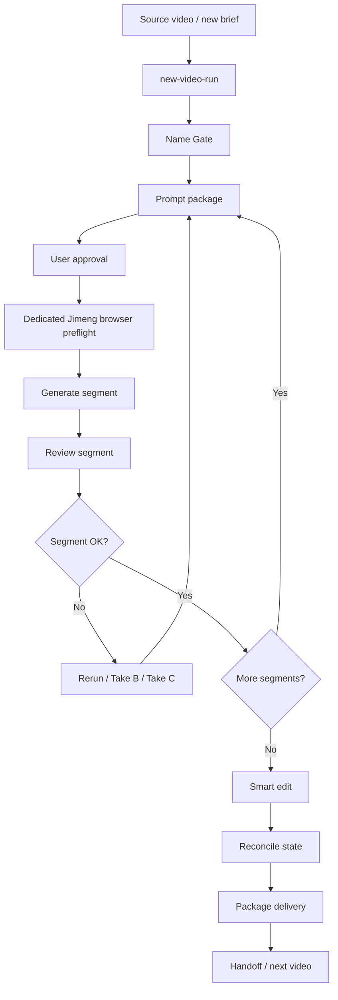

# Pipeline Overview

## What We Built

This is a semi-automatic AI video production pipeline.

It has three layers:

```text
Pipeline: the stable step-by-step production process.
Agent: Codex executes checks, scripts, packaging, and documentation.
Skill candidate: the rules are now structured enough to become a reusable AI video production skill later.
```

## Flow Diagram



## The Five Gates

### 1. Name Gate

Before generation, confirm:

- Current local video project
- Bound Jimeng dialogue for this video only
- Final video name
- Jimeng workspace URL

Stop if any name is unclear.

### 2. Prompt Approval Gate

Codex must show the generation prompt and current segment context before generating.

For Segment 02 and later, the prompt should reference the previous segment's tail frame or previous accepted video when needed.

### 3. Dedicated Browser Gate

Jimeng work must happen in the dedicated Chrome profile:

```bash
scripts/open_jimeng_dedicated_chrome.sh
```

The user's daily browser should not be used for Codex-controlled Jimeng generation.

### 4. User Confirmation Gate

Codex must not click generate until the user explicitly confirms the current generation package.

`continue-safe --stage generation` is expected to block unless explicit confirmation is passed after user approval.

### 5. Package Gate

Before final handoff:

```bash
python3 scripts/ai_video_trial.py reconcile-state --run-dir "data/runs/<run-id>"
python3 scripts/ai_video_trial.py continue-safe --run-dir "data/runs/<run-id>" --stage package
```

The delivery package should contain real copied files, not symlinks.

## Operating Rules

- Do not reuse a Jimeng dialogue for a different video.
- Do not move later segments into a new dialogue after Segment 01 has started.
- Do not click generate from search results or an unconfirmed dialogue.
- Do not treat the dedicated browser as proof that the correct dialogue is selected.
- Do not skip review just because a segment generated successfully.
- Do not package if `gate_status.json` disagrees with actual user decisions.

## Common Commands

Create a new guarded video run:

```bash
python3 scripts/ai_video_trial.py new-video-run \
  --video "<source-video>" \
  --final-video-name "<final-video-name>" \
  --jimeng-dialogue "<one-video-only-jimeng-dialogue>" \
  --workspace-url "<jimeng-workspace-url>"
```

Bind Name Gate to an existing run:

```bash
python3 scripts/ai_video_trial.py bind-name-gate \
  --run-dir "data/runs/<run-id>" \
  --final-video-name "<final-video-name>" \
  --jimeng-dialogue "<one-video-only-jimeng-dialogue>" \
  --workspace-url "<jimeng-workspace-url>"
```

Check generation safety:

```bash
python3 scripts/ai_video_trial.py continue-safe \
  --run-dir "data/runs/<run-id>" \
  --stage generation \
  --segment 1 \
  --require-browser
```

Package delivery:

```bash
python3 scripts/ai_video_trial.py package-delivery \
  --run-dir "data/runs/<run-id>" \
  --destination-root "<delivery-root>" \
  --name "<final-package-name>"
```

## Recommended Next Improvement

The next high-value upgrade is quality automation, not more browser automation:

- face consistency check
- black/green screen detection
- embedded subtitle/OCR risk detection
- automatic contact sheet comparison
- final subtitle/CTA generation

Keep Jimeng generation gated until those checks are reliable.
